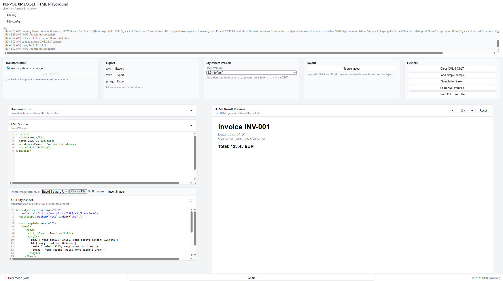
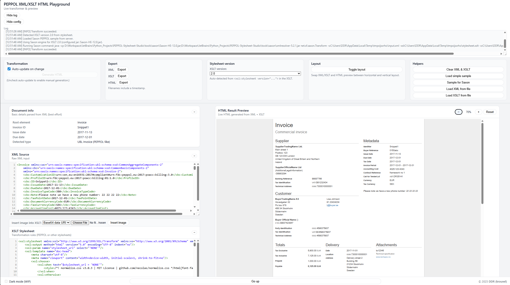

# PEPPOL Stylesheet Studio

A small web UI to load **XML** and **XSLT** (for example official PEPPOL stylesheets), transform them into **HTML**, and preview the result in the browser.

It supports:

- Local XSLT 1.0 transformations using **lxml/libxslt**
- Optional XSLT 2.0 / 3.0 transformations using **Saxon-HE** (Java)
- Syntax-highlighted editors for XML and XSLT
- Live HTML preview with zoom, layout controls and exports
- Basic document info extraction for PEPPOL/UBL-style invoices

---

## Features

### Editors & preview

- Two editors + preview:
  - **XML editor**
  - **XSLT editor** (with image insertion helper)
  - **HTML preview** on the right (or below, depending on layout)
- Syntax highlighting via CodeMirror
- `Ctrl + Space` completion helper for common XML/XSLT tags and attributes
- Auto-closing tags
- Independent scroll for HTML preview in side‑by‑side layout

### Transformation engines

- **Engine indicator** in the config panel:
  - `Engine: lxml (XSLT 1.0)`
  - `Engine: Saxon-HE (XSLT 2.0 / 3.0)` when Saxon is enabled
- Automatic detection of XSLT version from:
  ```xml
  <xsl:stylesheet version="...">
  ```
- UI selector for stylesheet version: **1.0 / 2.0 / 3.0**
- For version 1.0, the backend uses **lxml/libxslt**
- For version 2.0/3.0 and when configured, the backend uses **Saxon-HE**

### Config panel (header)

- **Auto-update on change** checkbox
  - When enabled, any edit triggers a debounced transform
  - When disabled, a **Generate HTML** button is enabled for manual runs
- **Export** buttons for:
  - XML
  - XSLT
  - HTML  
  with filenames including a timestamp like: `document_20250101_120300.xml`
- **Stylesheet version** dropdown (1.0 / 2.0 / 3.0)
- **Layout toggle**:
  - Side-by-side (left/right)
  - Stacked (top/bottom)
- **Helpers**:
  - Clear XML & XSLT
  - Load simple sample (XSLT 1.0)
  - Sample for Saxon (PEPPOL invoice + stylesheet from `samples/Saxon`)
  - Load XML from file
  - Load XSLT from file

### Document info panel

- Panel above the XML editor that shows:
  - Root element
  - Invoice ID (supports tags like `<cbc:ID>`)
  - Issue date (e.g. `<cbc:IssueDate>`)
  - Due date (e.g. `<cbc:DueDate>`)
  - Detected type (e.g. “Invoice”, “UBL Invoice (PEPPOL-like)”)
- Best-effort parsing via simple patterns (no full XML schema required)
- Collapsible, with its collapsed/expanded state stored in `localStorage`

### Layout & UX

- **Header**:
  - Project title and subtitle
  - Buttons to **Show/Hide config** and **Show/Hide log**
  - Log window with resizable height (approx. 3 cm by default)
- **Main area**:
  - Left pane: doc info + XML and XSLT editors
  - Right pane: HTML preview
  - In side-by-side mode, left pane is narrower and right pane is wider
- **Preview controls**:
  - Zoom **+ / − / Reset**
  - Zoom level indicator (e.g. `100%`)
  - Minimum preview height (configurable in CSS, currently ~800px) with vertical resize
- **Editor extras**:
  - Each editor (XML/XSLT) can be collapsed/expanded with a small `− / +` button
  - XSLT editor has an image helper:
    - Insert Base64 data URI image
    - Insert inline SVG
- **Footer**:
  - “Dark mode (WIP)” toggle (currently disabled, always light theme)
  - Centered **Go up** button (scrolls to top)
  - Right-aligned owner text: `© 2025 krouvel`

### Persistence

Almost everything is stored in the browser’s `localStorage`, including:

- XML content
- XSLT content
- Last HTML result
- Auto-update on/off
- Layout mode (horizontal / vertical)
- Stylesheet version
- Preview zoom level
- Config panel visible/hidden
- Log panel visible/hidden
- XML editor collapsed/expanded
- XSLT editor collapsed/expanded
- Document info collapsed/expanded

So when you reopen the app, it restores your previous state.

---

## Project structure

```text
project-root/
├─ app.py
├─ requirements.txt
├─ README.md
├─ samples/
│  └─ Saxon/
│     ├─ peppol-invoice.xml
│     └─ peppol-stylesheet.xslt
├─ templates/
│  ├─ index.html
│  └─ partials/
│     ├─ header.html
│     ├─ main.html
│     └─ footer.html
└─ static/
   ├─ css/
   │  ├─ base.css
   │  ├─ layout.css
   │  └─ components.css
   └─ js/
      ├─ app-core.js
      ├─ app-editors.js
      ├─ app-transform.js
      └─ app-ui.js
```

### CSS files

- `base.css`  
  Global variables, dark/light theme base, reset-ish rules, generic elements and shared button styles.

- `layout.css`  
  Overall page layout: header, config panel, main layout (horizontal/vertical), editor cards, preview, footer, responsive rules.

- `components.css`  
  Smaller UI components: engine indicator, zoom controls, XSLT image helper, CodeMirror sizing, log entries, document info panel, etc.

### JS files

- `app-core.js`  
  Global state, storage keys, logging, timestamps, generic helpers, theme bootstrap (currently forces light theme).

- `app-editors.js`  
  CodeMirror initialization, XML/XSLT hinting, image insertion into XSLT, document info parsing, editor collapse logic.

- `app-transform.js`  
  Communication with `/api/transform`, engine indicator updates, preview rendering, zoom logic, layout switching.

- `app-ui.js`  
  DOM event wiring for all buttons and toggles, file loaders, config/log visibility, state save/restore, and overall startup sequence.

---

## Requirements

### Python dependencies

Defined in `requirements.txt`:

```txt
# Python dependencies
Flask>=3.0.0
lxml>=5.0.0

# Non-Python dependencies (install separately):
# - Java 11+ runtime
# - Saxon-HE 12.x jar (download from Saxonica or Maven Central)
# - xmlresolver 5.x jar (download from xmlresolver.org or Maven Central)
#
# You can find these jars on Maven Central using sites like:
# https://mvnrepository.com/artifact
```

Install Python dependencies with:

```bash
pip install -r requirements.txt
```

### Non-Python dependencies (for XSLT 2.0 / 3.0 via Saxon)

To run PEPPOL / XSLT 2.0 / 3.0 stylesheets you also need:

- **Java** – JDK or JRE (Java 11+ recommended)
- **Saxon-HE** 12.x (e.g. `Saxon-HE-12.0.jar`)
- **xmlresolver** 5.x (e.g. `xmlresolver-5.2.1.jar`)

These are **not** installed via `pip`. You download the jars and place them in your project tree.

Recommended layout:

```text
tools/
  saxon/
    Saxon-HE-12.0.jar
    xmlresolver-5.2.1.jar
```

> 💡 Add the jars to `.gitignore` so they are **not committed** into your GitHub repo:
>
> ```gitignore
> tools/saxon/*.jar
> ```

---

## Installation

1. Clone or download the repository:

   ```bash
   git clone https://github.com/YOUR_USER/PEPPOL-Stylesheet-Studio.git
   cd PEPPOL-Stylesheet-Studio
   ```

2. Create & activate a virtual environment (optional but recommended):

   ```bash
   python -m venv .venv
   # Windows:
   .venv\Scriptsctivate
   # macOS / Linux:
   source .venv/bin/activate
   ```

3. Install Python dependencies:

   ```bash
   pip install -r requirements.txt
   ```

4. (Optional, for Saxon) Place Java jars:

   ```text
   tools/
     saxon/
       Saxon-HE-12.0.jar
       xmlresolver-5.2.1.jar
   ```

---

## Running the app locally

From the project root:

```bash
python app.py
```

The server starts on:

- `http://localhost:8000` on your machine  
- `http://<your-ip>:8000` for other devices on the same Wi‑Fi (because `host="0.0.0.0"`)

Open the URL in a browser.

---

## XSLT engines in detail

### 1. lxml/libxslt (XSLT 1.0 – default)

- Always available via the `lxml` Python library.
- Suitable for simple XSLT 1.0 stylesheets.
- If the XSLT uses 2.0/3.0-only features (like `xsl:function`, `xsl:sequence`, etc.), libxslt may fail; errors and warnings appear in the log.

The server selects this engine when:

- `SAXON_ENABLED` is `False` in `app.py`, or
- The UI “Stylesheet version” selector is set to `1.0`.

### 2. Saxon-HE (XSLT 2.0 / 3.0 – optional)

To run PEPPOL or other advanced XSLT 2.0/3.0 stylesheets:

1. **Install Java**

   Install a JDK or JRE (e.g. Temurin, Oracle JDK, etc.).

   Verify:

   ```bash
   java -version
   ```

2. **Download Saxon-HE & xmlresolver jars**

   Place them under `tools/saxon`:

   ```text
   tools/
     saxon/
       Saxon-HE-12.0.jar      # adjust name to your jar
       xmlresolver-5.2.1.jar  # or another 5.x version
   ```

   You can obtain these jars from:

   - Saxonica’s website (Saxon-HE downloads)
   - Maven Central (for example via: https://mvnrepository.com/artifact)

3. **Configure `app.py`**

   In `app.py`, adjust and enable:

   ```python
   SAXON_ENABLED = True

   BASE_DIR = os.path.dirname(__file__)
   SAXON_JAR_PATH = os.path.join(
       BASE_DIR, "tools", "saxon", "Saxon-HE-12.0.jar"
   )
   XMLRESOLVER_JAR_PATH = os.path.join(
       BASE_DIR, "tools", "saxon", "xmlresolver-5.2.1.jar"
   )
   ```

   The app will run Saxon using a command similar to:

   ```bash
   java -cp Saxon-HE-12.0.jar;xmlresolver-5.2.1.jar net.sf.saxon.Transform ...
   ```

   (On Linux/macOS the classpath separator is `:` instead of `;`.)

4. **Using Saxon from the UI**

   - Load an XSLT 2.0/3.0 stylesheet (e.g. the PEPPOL sample).
   - The app auto-detects `version="2.0"` or `version="3.0"` and changes the version dropdown.
   - When the dropdown is `2.0` or `3.0` and `SAXON_ENABLED = True`, the backend uses Saxon.
   - The header **Engine** section will show `Engine: Saxon-HE (XSLT 2.0)` or similar.

If Saxon or xmlresolver is missing or misconfigured, Saxon’s error messages and stack traces will be visible in the log.

---

## Samples

- **Load simple sample**  
  Loads a small built-in XML + XSLT 1.0 example suitable for the lxml engine.

- **Sample for Saxon**  
  Loads from:

  ```text
  samples/Saxon/peppol-invoice.xml
  samples/Saxon/peppol-stylesheet.xslt
  ```

  These files are intended for Saxon (2.0/3.0) rather than libxslt.

---

## Keyboard shortcuts & UX tips

- **Ctrl + Space** in XML/XSLT editors:
  - Shows a small list of tag/attribute suggestions.
  - If only one match exists, it will auto-complete.

- **Ctrl + S**:
  - Disabled; browser “Save page” dialog is blocked.
  - A small info entry is added to the log instead.

- **Auto-update**:
  - Turn on for immediate feedback while editing.
  - Turn off when working on large documents and use **Generate HTML** manually.

- **Collapse editors**:
  - Use `− / +` on XML/XSLT blocks to hide/show each editor.
  - State is remembered across page reloads.

- **Go up**:
  - “Go up” button in the footer scrolls back to the top of the UI.

---

## Deployment options

This app uses:

- A Python backend (**Flask**)
- Optional Java process (**Saxon-HE**)

So it cannot run purely as a static site (e.g. GitHub Pages only).

Typical deployment options:

- **Render, Railway, Fly.io, etc.** – host your Flask app linked to your GitHub repo.
- **GitHub Codespaces** – open the repo in a cloud dev container and run `python app.py`.
- **Your own VPS / server / Docker** – containerize the app and run it wherever you like.

If one day the XSLT transformations are done entirely in-browser (e.g. via Saxon-JS), then a fully static deployment (like GitHub Pages) would be possible.


## Screenshots
Main UI (XML/XSLT editors + HTML preview):

